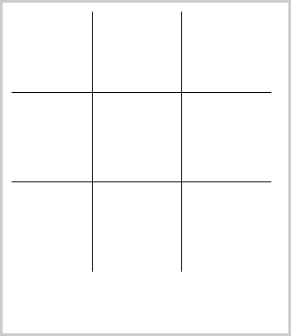

Tic-Tac-Toe
===========

A simple tic-tac-toe game. You can play, you can win!  
It is a game with GUI in Prolog.  
Prolog is fun, Games are fun, GUIs fun. Enjoy the code and the game!  

The game will restart with a click after the end.  
This not use the best algorithm. Tic-Tac-Toe is a limited game, with public solutions.  
The idea is have fun, you can win this game!  

Authors:  
Tiago Falcão  
Ricardo Saffi  

Delivered at: 2007-12-08  
To: Introduction to AI  
